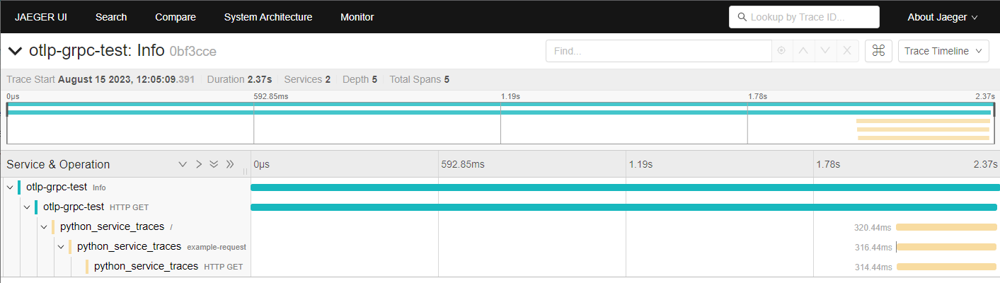
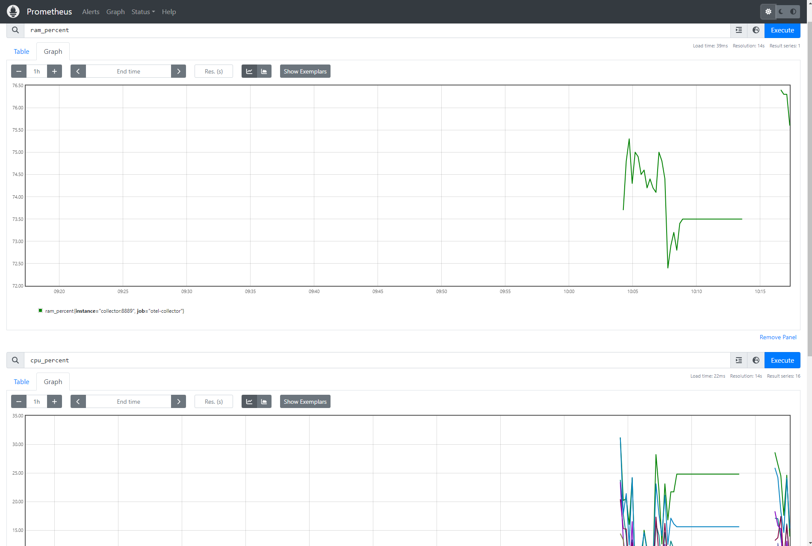

Docker compose for collector and jaeger

to run:
docker-compose up

to stop:
docker-compose down

Jaeger UI: http://localhost:16686/

Prometheus UI: http://localhost:9090/

Python app: http://localhost:5555/

Example images:

